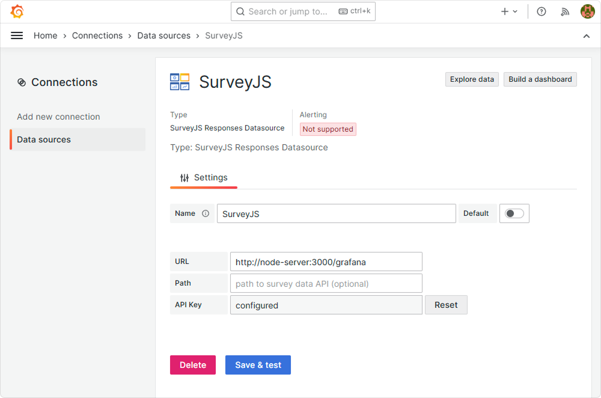
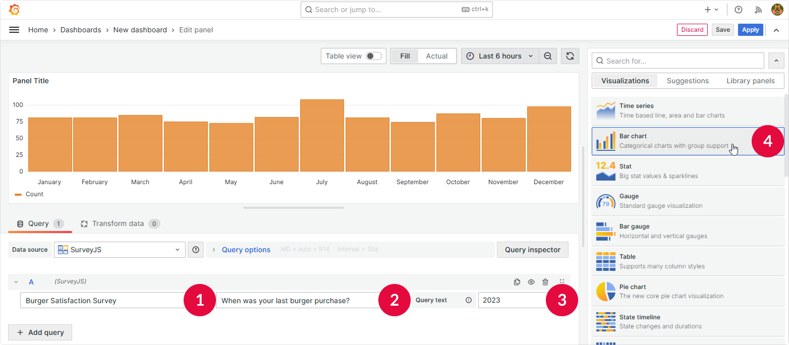

# SurveyJS Grafana DataSource Plugin

A plugin that lets Grafana query and visualize survey responses and analytics stored in MongoDB. It connects directly to the SurveyJS Analytics Service, enabling real-time insights and dashboard integration.

## Key Features

- Access survey metadata and responses
- View statistics for individual questions
- Monitor real-time updates as new responses arrive

## Installation

```bash
# Install dependencies
npm install

# Build plugin
npm run build

# Copy plugin to Grafana
cp -r dist/ /var/lib/grafana/plugins/surveyjs-grafana-datasource/

# Restart Grafana
systemctl restart grafana-server
```

## Configuration

### Set Up a Data Source

1. Open Grafana and navigate to **Home** > **Connections** > **Data sources**.
2. Select **SurveyJS Responses Datasource**.
3. Enter the backend service URL (e.g., `http://localhost:3000/grafana`) and path if needed.
4. Configure a secure API key if required.
5. Click **Save & test**.



### Create a Dashboard

1. In Grafana, navigate to **Home** > **Dashboards** and add a new dashboard.
2. Click **Add visualization**, select the SurveyJS data source, and configure a query.

### Configure a Query

1. Select a survey from available surveys in dropdown.
2. Select a question for analysis.
3. Enter additional filtering parameters in the Query text field.
4. Select an appropriate chart type based on data.




## Troubleshooting

### Connection Problems

- Verify backend service is running
- Check URL configuration
- Ensure network connectivity

### Data Not Loading

- Verify survey and question IDs
- Check backend service logs
- Test API endpoints directly

### Visualization Issues

- Ensure appropriate chart type for data
- Check data frame structure
- Verify query parameters

### Debug Mode

Enable debug logging in Grafana configuration to troubleshoot issues:

```json
{
  "log_level": "debug",
  "datasource_logging": true
}
```

## Learn More

- [Build a Data Source Plugin Tutorial](https://grafana.com/tutorials/build-a-data-source-plugin)
- [Grafana Documentation](https://grafana.com/docs/)
- [Grafana Tutorials](https://grafana.com/tutorials/)
- [Grafana UI Library](https://developers.grafana.com/ui)